# Сервис конвертации на Flask

## Настройка

Добавьте в файл `.env` с переменными окружения:

```bash
POSTGRES_USER=myuser
POSTGRES_PW=changeit
POSTGRES_PASSWORD=postgres
PGADMIN_MAIL=my@email.com
PGADMIN_PW=changeit
```

## Запуск

```bash
docker-compose up
```
### Выполнить миграцию

```
docker-compose exec backend python3.11 -c "from app.database import init_db; init_db()"
```
## Использование

| Метод | URL | Описание |
| ----- | --- | -------- |
| POST | /convert/json2xml | Конвертация JSON в XML |
| POST | /convert/xml2json | Конвертация XML в JSON |


## From XML to JSON

```mermaid
classDiagram
  direction RL
    namespace JSON {
        class id
        class user_id
        class first_name
        class second_name
        class middle_name
        class dict_sex_id
        class birthday
        class citizenship_id
        class motherland
        class email
        class tel_mobile
        class address_txt1
        class address_txt2
        class address_txt3
        class address_txt4
        class has_another_living_address
        class second_address_txt1
        class second_address_txt2
        class second_address_txt3
        class second_address_txt4
        class passport_type_id
        class passport_series
        class passport_number
        class passport_begda
        class passport_endda
        class passport_org_code
        class passport_issued_by
        class need_hostel
        class special_conditions
        class is_with_disabilities
        class diploma_series
        class diploma_number
        class diploma_date
        class diploma_registration_number
        class graduated_university_text
        class edu_diploma_name_text
        class snils
        class revision
        class passport_name_text
        class has_original_edu_diploma
        class passport_uuid
        class public_code
    }

    namespace XML {
        class EntrantChoice
        class Guid
        class AddEntrant
        class Identification
        class IdDocumentType
        class DocName
        class DocSeries
        class DocNumber
        class IssueDate
        class DocOrganization
        class Snils
        class IdGender
        class Birthday
        class Birthplace
        class Phone
        class Email
        class IdOksm
        class FreeEducationReason
        class IdFreeEducationReason
        class IdOksmFreeEducationReason
        class AddressList
        class Address
        class IsRegistration
        class FullAddr
        class IdRegion
        class City
        %% class String9Type
        %% class String13Type
        %% class SnilsType
        %% class UidType
        %% class String20Type
        %% class String50Type
        %% class String120Type
        %% class String150Type
        %% class String255Type
        %% class String500Type
        %% class String1024Type
        class Fields {
            Id
            IdCategory
            Name
            SubdivisionCode
            IdOksm
            Surname
            Name
            Patronymic
            }
        
    }

    birthday .. Birthday
    email .. Email
    tel_mobile .. Phone
    motherland .. Birthplace
    snils .. Snils
    passport_issued_by .. DocOrganization
    passport_begda .. IssueDate
    passport_number .. DocNumber
    passport_series .. DocSeries
    passport_type_id .. "10000 + passport_type_id" IdDocumentType
    passport_uuid .. Guid
    dict_sex_id .. IdGender
    first_name .. Fields
    second_name .. Fields
    middle_name .. Fields
    passport_org_code .. Fields
    citizenship_id .. IdOksm

    IdDocumentType ..o Fields

    Fields --o Identification
    IdDocumentType --o Identification
    DocName --o Identification
    DocSeries --o Identification
    DocNumber --o Identification
    IssueDate --o Identification
    DocOrganization --o Identification

    IdFreeEducationReason --o FreeEducationReason
    IdOksmFreeEducationReason --o FreeEducationReason

    Address --o AddressList
    IsRegistration --o Address
    FullAddr --o Address
    IdRegion --o Address
    City --o Address

    Identification --o AddEntrant
    Snils --o AddEntrant
    IdGender --o AddEntrant
    Birthday --o AddEntrant
    Birthplace --o AddEntrant
    Phone --o AddEntrant
    Email --o AddEntrant
    IdOksm --o AddEntrant
    FreeEducationReason --o AddEntrant
    AddressList --o AddEntrant

    Guid --o EntrantChoice
    AddEntrant --o EntrantChoice
    %% Fields o-- IdDocumentType

```




## From JSON to XML

```mermaid
classDiagram
  direction LR
    namespace JSON {
        class id
        class user_id
        class first_name
        class second_name
        class middle_name
        class dict_sex_id
        class birthday
        class citizenship_id
        class motherland
        class email
        class tel_mobile
        class address_txt1
        class address_txt2
        class address_txt3
        class address_txt4
        class has_another_living_address
        class second_address_txt1
        class second_address_txt2
        class second_address_txt3
        class second_address_txt4
        class passport_type_id
        class passport_series
        class passport_number
        class passport_begda
        class passport_endda
        class passport_org_code
        class passport_issued_by
        class need_hostel
        class special_conditions
        class is_with_disabilities
        class diploma_series
        class diploma_number
        class diploma_date
        class diploma_registration_number
        class graduated_university_text
        class edu_diploma_name_text
        class snils
        class revision
        class passport_name_text
        class has_original_edu_diploma
        class passport_uuid
        class public_code
    }

    namespace XML {
        class PackageData
        class IdJwt
        class EntityAction
        class SuccessResultList
        class Entrant
        class IdObject
        class Guid
        class Snils
        class IdGender
        class Birthday
        class Birthplace
        class Phone
        class Email
        class AvailabilityEduDoc
        class DateAvailabilityEduDoc
        class Surname
        class Name
        class Patronymic
        class IdOksm
        class FreeEducationReason
        class IdFreeEducationReason
        class IdOksmFreeEducationReason
        class AddressList
        class Address
        class IsRegistration
        class FullAddr
        class IdRegion
        class City
        class DocumentList
        class Document
        class Doc__Guid
        class FileHash
        class IdDocumentType
        class DocName
        class DocSeries
        class DocNumber
        class IssueDate
        class DocOrganization
        class IdCheckStatus
        class IdAchievementCategory
        class Photo
        class Photo__FileHash
        class Fui
        %% class ParamType
        %% class Param
        %% class Key
        %% class Value
        %% class ErrorType
        %% class SnilsType
        %% class UidType
        %% class String20Type
        %% class String32Type
        %% class String50Type
        %% class String120Type
        %% class String150Type
        %% class String100Type
        %% class String200Type
        %% class String255Type
        %% class String350Type
        %% class String500Type
        %% class String1024Type
    }
    id .. IdObject
    first_name .. Name
    second_name .. Surname
    middle_name .. Patronymic

    birthday .. Birthday
    email .. Email
    tel_mobile .. Phone
    motherland .. Birthplace
    snils .. Snils

    %% passport_issued_by .. DocOrganization
    %% passport_begda .. IssueDate
    %% passport_number .. DocNumber
    %% passport_series .. DocSeries
    %% passport_type_id .. "10000 + passport_type_id" IdDocumentType

    passport_uuid .. Guid
    dict_sex_id .. IdGender

    %% first_name .. Fields
    %% second_name .. Fields
    %% middle_name .. Fields
    %% passport_org_code .. Fields
    citizenship_id .. IdOksm

    has_original_edu_diploma .. AvailabilityEduDoc
    %% diploma_date .. DateAvailabilityEduDoc
    diploma_series .. DocSeries
    diploma_number .. DocNumber
    graduated_university_text .. DocOrganization
    edu_diploma_name_text .. DocName
    diploma_registration_number .. Doc__Guid
    diploma_date .. IssueDate



    IdJwt --o PackageData
    EntityAction --o PackageData
    SuccessResultList --o PackageData

    Entrant --o SuccessResultList

    IdObject --o Entrant
    Guid --o Entrant
    Snils --o Entrant
    IdGender --o Entrant
    Birthday --o Entrant
    Birthplace --o Entrant
    Phone --o Entrant
    Email --o Entrant
    AvailabilityEduDoc --o Entrant
    DateAvailabilityEduDoc --o Entrant
    Surname --o Entrant
    Name --o Entrant
    Patronymic --o Entrant
    IdOksm --o Entrant
    FreeEducationReason --o Entrant

    IdFreeEducationReason --o FreeEducationReason
    IdOksmFreeEducationReason --o FreeEducationReason

    AddressList --o Entrant
    Address --o AddressList
    IsRegistration --o Address
    FullAddr --o Address
    IdRegion --o Address
    City --o Address

    DocumentList --o Entrant
    Document --o DocumentList
    Doc__Guid --o Document
    FileHash --o Document
    IdDocumentType --o Document
    DocName --o Document
    DocSeries --o Document
    IssueDate --o Document
    DocOrganization --o Document
    IdCheckStatus --o Document
    IdAchievementCategory --o Document

    Photo --o Entrant
    Photo__FileHash --o Photo
    Fui --o Photo

```

